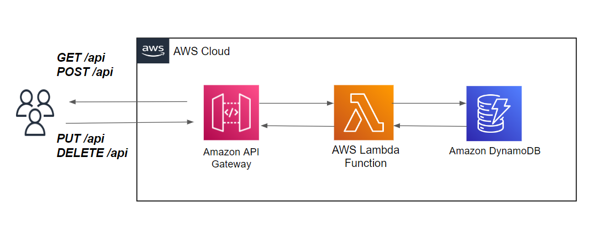

# Create a CRUD API with Lambda, DynamoDB and API Gateway     

  

__Steps :__   

## 1. Create DynamoDB Table `posts` and import data using python script

* Create a `boto3user` user account in IAM and attach the `AmazonDynamoDBFullAccess` policy  
* Create a table `posts` in DynamoDB console and set `id` as primary key `string` type 
* Boto3 python script to import initial data into DynamoDB database :

File : __[DynamoDB.py](file/DynamoDB.py)__   

```   
#!/usr/bin/python3

import json
import boto3
import uuid

def main():
    # create resource client session
    db = boto3.resource('dynamodb',region_name='us-east-1')
    table = db.Table('posts')

    # read the json data and upload the file
    with open('data.json') as json_file:
            data = json.load(json_file)

    # Add id in the json data
    for item in data:
        myId = str(uuid.uuid4())
        item["id"]=myId

    # Insert all the items/row
    for i in data:
        table.put_item(Item=i)

    # Fetch/scan all the items
    res=table.scan()

    # loop through items
    for i in res["Items"]:
        print(i)

if __name__ == "__main__":
    main()
```   

File : __[data.json](file/data.json)__     

```   
[
  {
    "title": "Post 2",
    "body": "Body of post.",
    "category":"Event",
    "likes": 2,
    "tags": ["news", "events"]
  },
  {
    "title": "Post 3",
    "body": "Body of post.",
    "category":"Tech",
    "likes": 3,
    "tags": ["news", "events"]
  },
  {
    "title": "Post 4",
    "body": "Body of post.",
    "category":"Event",
    "likes": 4,
    "tags": ["news", "events"]
  },
  {
    "title": "Post 5",
    "body": "Body of post.",
    "category":"News",
    "likes": 5,
    "tags": ["news", "events"]
  }
]
```   

Note: After creating all the items boto3 script also list/scan all the items.  

## 2. Create Lambda function to fatch data from dynamoDB and assign permission to the lambda function to fatch data from dynamoDB  

* Create a Lambda Function named `posts`
* Goto `Configuration` tab then `permissions` tab and click on whatever role name is showing like `posts-role-XXXX` which is going to redirect the `IAM > Roles`, then here on `permissions` tab click on `Add Permissions > Create inline policy` and on JSON tab paste below json code 

File : __[Lambda.json](files/lambda.json)__   
```
{
    "Version": "2012-10-17",
    "Statement": [
        {
            "Sid": "ListAndDescribe",
            "Effect": "Allow",
            "Action": [
                "dynamodb:List*",
                "dynamodb:DescribeReservedCapacity*",
                "dynamodb:DescribeLimits",
                "dynamodb:DescribeTimeToLive"
            ],
            "Resource": "*"
        },
        {
            "Sid": "SpecificTable",
            "Effect": "Allow",
            "Action": [
                "dynamodb:BatchGet*",
                "dynamodb:Get*",
                "dynamodb:Query",
                "dynamodb:Scan",
                "dynamodb:PutItem",
                "dynamodb:DeleteItem",
                "dynamodb:UpdateItem"
            ],
            "Resource": "arn:aws:dynamodb:*:*:table/posts"
        }
    ]
}
```  

The aboce json permission code basicaly allows the lambda function to access the `posts` table and allow to perform above listed actions. 

__Lambda funtion code :__  

File : __[posts_lambdaFunc.py](files/posts_lambdaFunc.py)__   
```
import json
import boto3
import uuid

def createPost(event, table):
    req_body = json.loads(event['body'])
    if req_body is None:
        err = f"body is empty, please supply elemets."
        return err, 1
    error = []
    item = {}
    # checking for title
    if req_body['title'] != "":
        item.update({'title':req_body['title']})
    else:
        error.append("'title' not provided.")
    # checking for body
    if req_body['body'] != "":
        item.update({'body':req_body['body']})
    else:
        error.append("'body' not provided.")
    # checking for category
    if req_body['category'] != "":
        item.update({'category':req_body['category']})
    else:
        error.append("'category' not provided.")
    # checking for likes
    if req_body['likes'] != "":
        item.update({'likes':req_body['likes']})
    else:
        error.append("'likes' not provided.")
    # checking for tags
    if req_body['tags'] != "":
        item.update({'tags':req_body['tags']})
    else:
        error.append("'tags' not provided.")
    if len(error) == 0:
        # write the data into the dynamdoDB with generated id
        # generate Id
        myId = str(uuid.uuid4())
        item.update({'id':myId})
        table.put_item(Item=item)
        return item, 0
    else:
        return error, 1

def updatePost(event, table):
    req_body = json.loads(event['body'])
    if req_body is None:
        err = f"body is empty, please supply elemets."
        return err, 1
    error = []
    item = {}
    # checking for id
    if req_body['id'] != "":
        item.update({'id':req_body['id']})
    else:
        error.append("'id' not provided.")
    # checking for title
    if req_body['title'] != "":
        item.update({'title':req_body['title']})
    else:
        error.append("'title' not provided.")
    # checking for body
    if req_body['body'] != "":
        item.update({'body':req_body['body']})
    else:
        error.append("'body' not provided.")
    # checking for category
    if req_body['category'] != "":
        item.update({'category':req_body['category']})
    else:
        error.append("'category' not provided.")
    # checking for likes
    if req_body['likes'] != "":
        item.update({'likes':req_body['likes']})
    else:
        error.append("'likes' not provided.")
    # checking for tags
    if req_body['tags'] != "":
        item.update({'tags':req_body['tags']})
    else:
        error.append("'tags' not provided.")
    if len(error) == 0:
        # write the data into the dynamdoDB
        # updating items
        UpdateExpression = 'SET likes = :l, category = :c, tags = :tg, title = :tt, body = :b'
        ExpressionAttributeValues = {
            ':l': item['likes'],
            ':c': item['category'],
            ':tg': item['tags'],
            ':tt': item['title'],
            ':b': item['body']
        }
        update = table.update_item(
            Key={
                'id': item['id']
            },
            ConditionExpression='attribute_exists(id)',
            UpdateExpression=UpdateExpression,
            ExpressionAttributeValues=ExpressionAttributeValues
        )
        # if updated successfully then fetch latest data
        if update['ResponseMetadata']['HTTPStatusCode'] == 200:
            res=table.get_item(Key={"id":item['id']})
        return res['Item'], 0
    else:
        return error, 1

def deletePost(event, table):
    # default_limit
    if 'queryStringParameters' in event and event['queryStringParameters'] is not None and 'id' in event['queryStringParameters']:
        id = event['queryStringParameters']['id']
        res=table.delete_item(Key={"id":id})
        statusCode = res['ResponseMetadata']['HTTPStatusCode']
        return statusCode, f"Item Deleted"
    else:
        return 200, f"Error: Posts ID is not provided!!"

def getPost(event, table):
    # default_limit
    limit: int = 4
    if 'queryStringParameters' in event and event['queryStringParameters'] is not None and 'limit' in event['queryStringParameters']:
        limit = int(event['queryStringParameters']['limit'])
    result = table.scan(Limit=limit)
    return result["Items"]

def lambda_handler(event, context):
    db = boto3.resource('dynamodb',region_name='us-east-1')
    table = db.Table('posts')
    # setting up return value
    http_res = {}
    http_res['headers'] = {}
    http_res['headers']['Content-Type'] = 'application/json'
    if event['httpMethod'] == "GET":
        res = getPost(event, table)
        # return value
        http_res['statusCode'] = 200
        http_res['body'] = json.dumps(str(res))
    elif event['httpMethod'] == "POST":
        res, status = createPost(event, table)
        if status == 0:
            # return value
            http_res['statusCode'] = 200
            http_res['body'] = json.dumps(str(res))
        else:
            # return value
            http_res['statusCode'] = 200
            http_res['body'] = json.dumps(str(res))
    elif event['httpMethod'] == "PUT":
        res, status = updatePost(event, table)
        if status == 0:
            # return value
            http_res['statusCode'] = 200
            http_res['body'] = json.dumps(str(res))
        else:
            # return value
            http_res['statusCode'] = 200
            http_res['body'] = json.dumps(str(res))
    elif event['httpMethod'] == "DELETE":
        status, res = deletePost(event, table)
        # return value
        http_res['statusCode'] = status
        http_res['body'] = json.dumps(str(res))
    else:
        # return value
        http_res['statusCode'] = 200
        http_res['body'] = json.dumps("Could not understand the HTTP Method. Please Try again with CREATE, UPDATE, DELETE and GET")
    return http_res
```

Put the above code on Lambda function code and create a test case using `apigateway-aws-proxy` and change the "httpMethod" from POST to GET and on "queryStringParameters" change the `"foo": "bar"` with `"limit":1`.  While experimenting with the testcases i am not able to create test for POST method but, it eventually works with the restapi gateway anyway.  

## 3. In API Gateway create two API endpoints (GET and POST) and integrate them with the lambda function.   

* On API Gateway create New API choose `REST API`, give it a name like `postsAPI` and choose Endpoint Type as `regional`
* Click on `Action > Create New Resource, Set resource name `posts` and click on `Create Resource`  
* Create GET API Gateway 
    * Select `Posts` on left sidebar then click on `Actions > Create Method` Select GET and click on right sign
    * Select Integraion type : lambda function, check the `Use Lambda Proxy integration` box, put the name of the Lambda Function `posts` and click on save. 
    * Now click on Test icon and press Test Button, then the lambda function will be invoked and the data will be returned. 
    * Now on the `Query Strings` box put `limit=1`, then it is going to return only 1 item, it means the query string option is working.  
* Create POST API Gateway 
    * Select `Posts` on left sidebar then click on `Actions > Create Method` Select POST and click on right sign
    * Select Integraion type : lambda function, check the `Use Lambda Proxy integration` box, put the name of the Lambda Function `posts` and click on save.   
    * Put the below json code on the Request Body  

    ```  
    {
    "title": "Post 9",
    "body": "Body of post.",
    "category":"Tech",
    "likes": 3,
    "tags": ["news", "war"]
    }
    ```  

    * Now click on Test icon and press Test Button, then the lambda function will be invoked and new item will be written in dynamoDB and the same data will also be returned as response.  
* Create PUT API Gateway 
    * Select `Posts` on left sidebar then click on `Actions > Create Method` Select PUT and click on right sign
    * Select Integraion type : lambda function, check the `Use Lambda Proxy integration` box, put the name of the Lambda Function `posts` and click on save.   
    * Put the below json code on the Request Body  

    ```  
    {
    "id" : "Get_the_id_of_an_items"
    "title": "Updated Post 9",
    "body": "Updated Body of post.",
    "category":"Tech",
    "likes": 3,
    "tags": ["news", "war"]
    }
    ```  

    * Now click on Test icon and press Test Button, then the lambda function will be invoked and new item will be written in dynamoDB and the same data will also be returned as response.  
* Create DELETE API Gateway 
    * Select `Posts` on left sidebar then click on `Actions > Create Method` Select DELETE and click on right sign
    * Select Integraion type : lambda function, check the `Use Lambda Proxy integration` box, put the name of the Lambda Function `posts` and click on save.   
    * Now click on Test icon and press Test Button, then the lambda function will be invoked and the data will be returned. 
    * Now on the `Query Strings` box put `id=<ID_Of_Any_post_items>`, then it will going to delete item, it means the query string option is working.  
* Now Select `Posts` on left sidebar then click on `Actions > Deploy API`, on `Deployment stage` select `[New Stage]` and on `Stage name` select `Dev` or something and click on deploy, and click on save changes.  
* Now on the left sidebar click on get and post method then you will find the api url. 


## 4. Now test the API endpoints with the Postman 

* Open postman, create a new collection > new request and first test the get request or you can also use curl 

Example 1 with default limit 

```
curl --location --request GET 'https://pquv5ud1if.execute-api.us-east-1.amazonaws.com/Dev/posts'
```

Example 2 with limit querystring 

```
curl --location --request GET 'https://pquv5ud1if.execute-api.us-east-1.amazonaws.com/Dev/posts?limit=2'
```

* Testing the post API 
    * Put the url `https://pquv5ud1if.execute-api.us-east-1.amazonaws.com/Dev/posts` and change the method to POST
    * On the request Body tab change the datatype to JSON and put the below json payload 
    ```
    {
    "title": "Post 500",
    "body": "Body of post.",
    "category":"Tech",
    "likes": 1,
    "tags": ["romance"]
    }
    ```
    * Now run the query, it will basically return the newly added item with id. 


* Testing the PUT API 
    * Put the url `https://pquv5ud1if.execute-api.us-east-1.amazonaws.com/Dev/posts` and change the method to POST
    * On the request Body tab change the datatype to JSON and put the below json payload 
    ```
    {
    "id":"96de88e6-ef65-4a72-a8be-1ce4adfc6c87",
    "title": "Post 500",
    "body": "Body of post.",
    "category":"Tech",
    "likes": 1,
    "tags": ["romance"]
    }
    ```
    * Now run the query, it will basically update the item with particular id and return with updated data. 

* Testing the DELETE API  

With curl command:  

```
curl --location --request DELETE 'https://h6yfb6fdb8.execute-api.us-east-1.amazonaws.com/Dev/posts?id=fbb25218-8ca4-4515-95cb-8056ccdbde79'
```
    
## 5. Deleting Everything : 

* First Delete the API Gateway
* Then Delete the Lamda Function
* Delete the DynamoDB table 
* Delete the boto3user from IAM console


